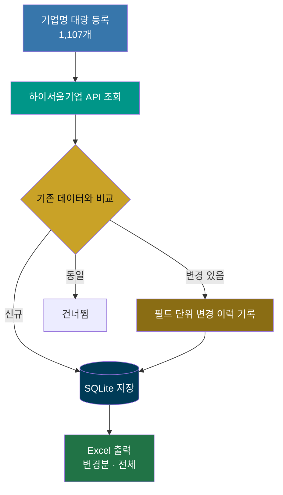

# Company Data Update Automation
### 기업 데이터 자동 갱신 및 비교 시스템

실제 인턴십에서 수행한 반복적인 기업 데이터 갱신 업무를 자동화하기 위해 개발한 FastAPI 기반 로컬 웹 애플리케이션입니다.

> *A FastAPI-based local web application developed to automate repetitive company data synchronization tasks during an internship.*

---

## 🔄 동작 흐름

사람이 하던 판단은 **"이 기업 정보가 지난번과 달라졌는가"** 하나였습니다.
그 비교를 필드 단위로 자동화하고, 달라진 것만 뽑아 보여주는 게 이 도구의 핵심입니다.

---

## 📌 프로젝트 배경

기존 업무에서는 하이서울기업에 등록된 **1,107개 기업**을 하나씩 검색하여 변경 사항을 확인하고 Excel 파일을 직접 수정해야 했습니다.

반복적인 수작업으로 인해 많은 시간이 소요되었으며, 데이터 변경 여부를 사람이 직접 비교해야 하는 비효율적인 업무였습니다.

---

## 💡 해결 방법

- 하이서울기업 데이터 조회 API 연동
- SQLite 기반 기업 데이터 저장 및 변경 비교
- 필드 단위 변경 이력 자동 관리
- 기업명 대량 등록 및 자동 매칭
- 변경 결과 및 전체 데이터를 Excel로 자동 출력
- 로컬 웹 애플리케이션(FastAPI) 형태로 구현하여 별도 서버 없이 실행 가능

---

## 🚀 성과

- 처리 대상 기업 : **1,107개**
- 자동 매칭 : **1,056개**
- 업무 시간 : **약 2주 → 2시간 미만**
- 반복적인 수작업 제거
- 데이터 변경 이력 자동 관리
- 업무 효율성과 데이터 정확성 향상

---

## 🛠 Tech Stack

- Python
- FastAPI
- SQLite
- OpenPyXL
- HTML / CSS / JavaScript

---

> **본 저장소에는 프로그램 소스 코드만 포함되어 있습니다.**
>
> 데이터베이스(DB), 환경설정(.env), 실제 업무 데이터는 보안 및 개인정보 보호를 위해 제외하였습니다.

---

# 하이서울기업 로컬 데이터 관리자

하이서울기업의 기업정보를 검색해 PC의 SQLite 데이터베이스에 저장하고, 재검색 시 달라진 필드를 기록·표시하는 FastAPI 기반 로컬 웹 애플리케이션입니다.
